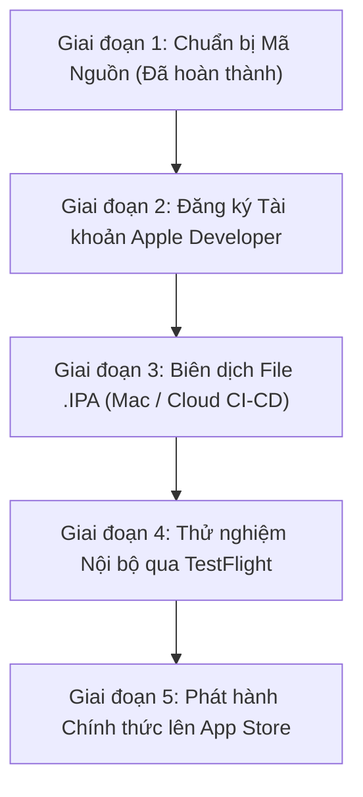

# KẾ HOẠCH TRIỂN KHAI & PHÁT HÀNH ỨNG DỤNG TITSMART MOBILE TRÊN iOS

> **Dự án**: Hệ Thống Quản Lý Công Việc TITSMART (TITSMART Task Management)  
> **Nền tảng**: iOS (iPhone / iPad)  
> **Công nghệ**: Flutter (Dart), Native iOS Xcode, Apple TestFlight & App Store  
> **Trạng thái cấu hình**: Đã hoàn tất 100% cấu hình mã nguồn cross-platform, bộ icon `AppIcon` & quyền riêng tư `Info.plist`.

---

## 📋 TỔNG QUAN LỘ TRÌNH



---

## 🎯 CHI TIẾT CÁC GIAI ĐOẠN TRIỂN KHAI

### 🔹 GIAI ĐOẠN 1: CHUẨN BỊ MÃ NGUỒN & TÀI NGUYÊN (ĐÃ HOÀN THÀNH 100%)
- [x] **Đồng bộ Logic Cross-Platform**: Toàn bộ tính năng phân quyền Quản lý/Nhân viên, điểm danh GPS, chụp ảnh selfie, gửi báo cáo hoàn thành, đính kèm tệp (`.csv`, `.docx`, `.xlsx`, `.pdf`) đã hoạt động tương thích trên iOS.
- [x] **Cấu hình `Info.plist`**:
  - **Tên hiển thị**: `TITSMART Task Management`
  - **Quyền Camera**: `NSCameraUsageDescription` (Chụp ảnh selfie điểm danh & báo cáo).
  - **Quyền Thư viện**: `NSPhotoLibraryUsageDescription` (Chọn ảnh đính kèm).
  - **Quyền Định vị GPS**: `NSLocationWhenInUseUsageDescription` (Xác thực vị trí làm việc tại công trình).
- [x] **Bộ Biểu Tượng AppIcon**: Đã sinh trọn bộ 15 icon chuẩn Retina từ logo web `logo.png` tại `ios/Runner/Assets.xcassets/AppIcon.appiconset`.

---

### 🔹 GIAI ĐOẠN 2: ĐĂNG KÝ TÀI KHOẢN APPLE DEVELOPER
1. **Đăng ký Apple Developer Program**:
   - Loại tài khoản: **Company / Organization** (Doanh nghiệp) hoặc **Individual** (Cá nhân).
   - Chi phí: $99 / năm.
2. **Tạo App ID & Chứng chỉ (Certificates & Provisioning Profiles)**:
   - Đăng nhập [Apple Developer Portal](https://developer.apple.com).
   - Tạo **App ID**: `com.titsmart.taskmanagement` (hoặc Bundle ID tương đương).
   - Tạo **Apple Distribution Certificate** & **App Store Provisioning Profile**.

---

### 🔹 GIAI ĐOẠN 3: BIÊN DỊCH ỨNG DỤNG (.IPA) (LỰA CHỌN 1 TRONG 2 PHƯƠNG ÁN)

#### 🍏 Phương án A: Biên dịch trên máy macOS (MacBook / Mac Mini)
1. Cài đặt Xcode & CocoaPods:
   ```bash
   sudo gem install cocoapods
   cd ios && pod install
   ```
2. Chạy lệnh đóng gói sản phẩm phát hành:
   ```bash
   flutter build ipa --release
   ```
3. Mở Xcode Organizer và tải trực tiếp lên Apple App Store Connect.

#### ☁️ Phương án B: Biên dịch Tự động bằng Cloud CI/CD (Không cần có máy Mac)
Nếu hiện tại chưa có sẵn máy MacBook, có thể thiết lập Cloud CI/CD để tự động build file `.ipa` từ Git:
- **Codemagic** (Tích hợp chuẩn với Flutter): Tự động lấy code từ GitHub/GitLab, build `.ipa` và gửi thẳng lên TestFlight.
- **GitHub Actions (MacOS Runner)**: Chạy script workflow tự động build mỗi khi push code lên nhánh release.

---

### 🔹 GIAI ĐOẠN 4: THỬ NGHIỆM NỘI BỘ VÀ NGHIỆM THU (TESTFLIGHT)
1. Upload bản build đầu tiên lên **Apple TestFlight**.
2. Thêm danh sách email Quản lý & Nhân viên vào nhóm **Internal Testers**.
3. Nhân viên mở app TestFlight trên iPhone để tải và nghiệm thực tế các tính năng:
   - Đăng nhập & phân quyền tự động.
   - Chụp selfie + lấy tọa độ GPS điểm danh.
   - Báo cáo công việc kèm đính kèm file (`.csv`, `.docx`, `.xlsx`, `.pdf`).
   - Quản lý duyệt báo cáo & nghiệm thu công việc.

---

### 🔹 GIAI ĐOẠN 5: PHÁT HÀNH CHÍNH THỨC LÊN APPLE APP STORE
1. **Chuẩn bị hồ sơ App Store Connect**:
   - Ảnh chụp màn hình ứng dụng (Screenshot iPhone 6.5 inch & 5.5 inch).
   - Mô tả ứng dụng, từ khóa tìm kiếm (Keywords).
   - Trang chính sách bảo mật thông tin (Privacy Policy URL).
2. **Gửi duyệt (Submit for Review)**:
   - Đội ngũ kiểm duyệt của Apple (App Review Team) sẽ đánh giá ứng dụng (thường từ 24 - 48 giờ).
3. **Phát hành (Publish)**:
   - Sau khi được phê duyệt, ứng dụng sẽ có mặt chính thức trên App Store để toàn bộ nhân sự công ty tải về sử dụng.

---

## 📌 BẢNG TỔNG HỢP TIẾN ĐỘ & PHÂN CÔNG

| Hạng mục | Nền tảng | Trạng thái | Ghi chú |
| :--- | :---: | :---: | :--- |
| Mã nguồn Flutter (Dart) | iOS & Android | ✅ Hoàn thành | Đã tối ưu UI/UX, hỗ trợ upload file CSV, DOCX, XLSX, PDF |
| Logo & Icon ứng dụng | iOS & Android | ✅ Hoàn thành | Lấy từ `logo.png` của Web Client |
| Cấu hình `Info.plist` & Quyền | iOS | ✅ Hoàn thành | Đã thêm Camera, GPS, Thư viện ảnh, App Display Name |
| Đăng ký Apple Developer | iOS | ⏳ Cần chuẩn bị | Đăng ký tài khoản doanh nghiệp Apple ($99/năm) |
| Đóng gói file `.ipa` | iOS | ⏳ Sẵn sàng | Có thể build bằng Xcode trên Mac hoặc Codemagic Cloud |
| Thử nghiệm TestFlight | iOS | ⏳ Sẵn sàng | Mời nhân sự dùng thử qua email |
| Phát hành App Store | iOS | ⏳ Sẵn sàng | Gửi duyệt công khai |
